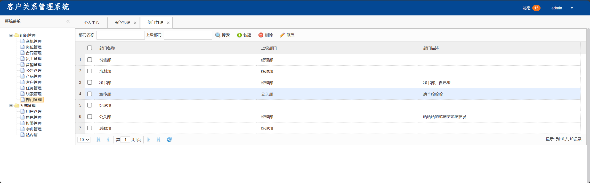
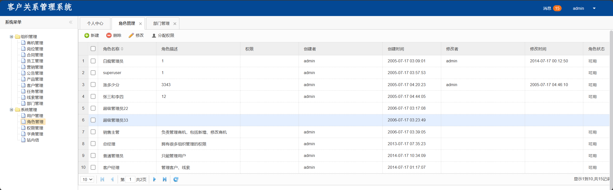

# crm

#### 项目仅为纪念 spring mvc、jsp

# env
- java 8/11/17
- [Tomcat](https://tomcat.apache.org/download-90.cgi) 9+
- mysql 8+ or mariadb 10.6+
```bash
# mvnw from
"/JetBrains/IntelliJ IDEA/plugins/maven/lib/maven3/bin/mvn" wrapper:wrapper
# import sql
# mysql -u root -p
source docs/crm.sql;
```

# startup
```bash
# run
./mvnw clean package
mv target/crm.war /tomcat/webapps/
/tomcat/bin/startup
```



